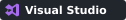

# Hey, I'm Calvin 👋

`Flourish0x`

I’m a self-taught developer mainly working with **JavaScript** and **C#**.  
I build websites, apps, tools, music-related software, and whatever else seems interesting enough to turn into a project.

## Currently working on

  

  

## My Tech Stack

### Languages

### Backend / Data

### Tools

## Stats

  

